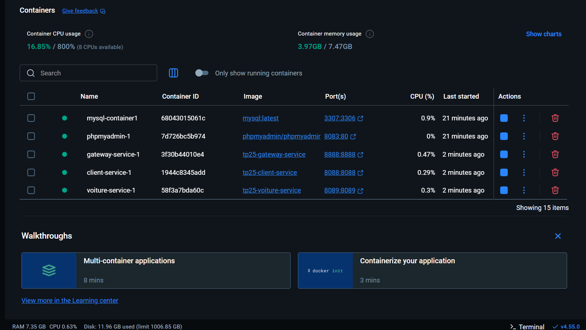
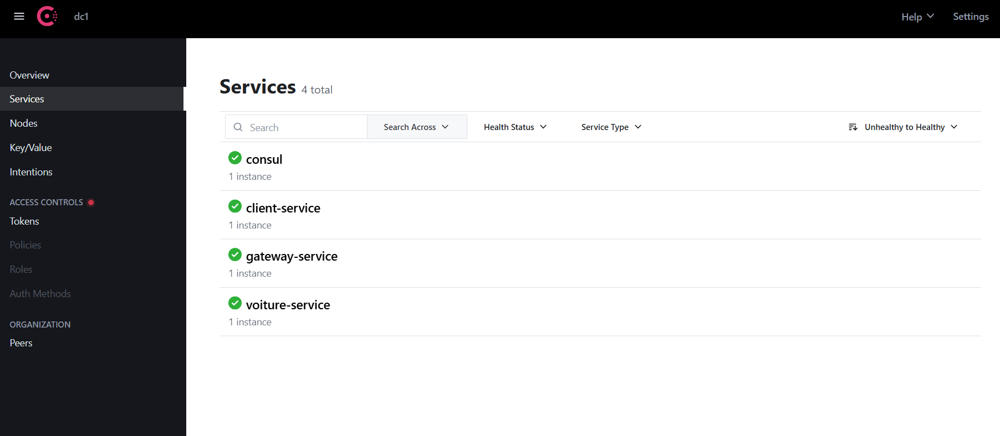
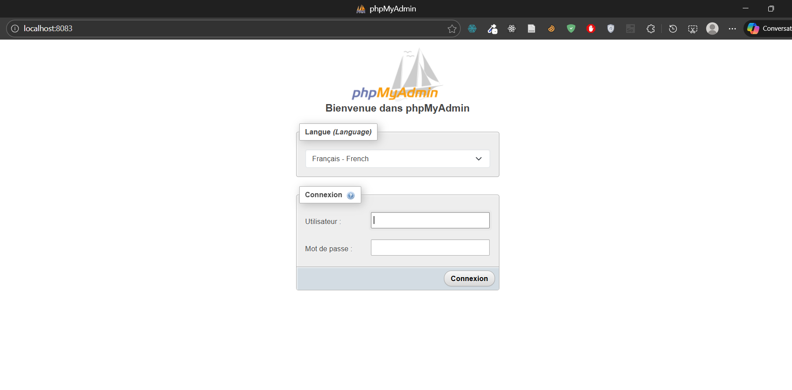

# TP25 - Conteneurisation Microservices avec Docker + Consul

**Auteur:** Zineb  
**Date:** Janvier 2026

---

## Description
Architecture microservices conteneurisee avec Docker et decouverte de services via Consul.

### Composants
| Service | Port | Description |
|---------|------|-------------|
| **Consul** | 8500 | Service Discovery |
| **MySQL** | 3306 | Base de donnees |
| **Gateway** | 8888 | API Gateway |
| **Client** | 8088 | Microservice Client |
| **Voiture** | 8089 | Microservice Voiture |
| **phpMyAdmin** | 8081 | Administration BDD |

## Architecture

```
                      ┌─────────────────┐
                      │     Consul      │
                      │     (8500)      │
                      └────────┬────────┘
                               │ Discovery
         ┌─────────────────────┼─────────────────────┐
         │                     │                     │
         ▼                     ▼                     ▼
┌─────────────────┐  ┌─────────────────┐  ┌─────────────────┐
│    Gateway      │  │     Client      │  │    Voiture      │
│    (8888)       │  │    (8088)       │  │    (8089)       │
└─────────────────┘  └────────┬────────┘  └────────┬────────┘
                              │                     │
                              └──────────┬──────────┘
                                         │
                              ┌──────────▼──────────┐
                              │       MySQL         │
                              │      (3306)         │
                              └─────────────────────┘
```

## Pre-requis
- Docker Desktop installe
- Ports 3306, 8081, 8088, 8089, 8500, 8888 disponibles

## Commandes

### Construire et demarrer
```bash
docker compose up -d --build
```

### Verifier l'etat
```bash
docker compose ps
```

### Voir les logs
```bash
docker compose logs -f consul
docker compose logs -f client-service
docker compose logs -f voiture-service
```

### Arreter
```bash
docker compose down
```

### Arreter et supprimer les volumes
```bash
docker compose down -v
```

## URLs d'acces

| Service | URL |
|---------|-----|
| Consul UI | http://localhost:8500 |
| phpMyAdmin | http://localhost:8081 |
| Gateway | http://localhost:8888 |
| Service Client | http://localhost:8088/api/clients |
| Service Voiture | http://localhost:8089/api/voitures |

## Test des endpoints

### Via Gateway
```bash
# Liste des clients
curl http://localhost:8888/api/clients

# Liste des voitures
curl http://localhost:8888/api/voitures
```

### Direct
```bash
# Health check Client
curl http://localhost:8088/api/clients/health

# Health check Voiture
curl http://localhost:8089/api/voitures/health
```

## Points cles

### Pourquoi "mysql" et pas "localhost" ?
Dans Docker Compose, les conteneurs communiquent via leur nom de service:
- `mysql` = nom DNS du conteneur MySQL
- `consul` = nom DNS du conteneur Consul
- `localhost` = le conteneur lui-meme (incorrect)

### Multi-stage Dockerfile
1. **Stage Builder**: compile avec Maven
2. **Stage Runtime**: image legere avec le JAR

.
## How to Run

1.  **Build and Start**:
    Run the following command in the root directory:
    ```bash
    docker compose up -d --build
    ```
    

2.  **Check Status**:
    Verify that all containers are running:
    ```bash
    docker compose ps
    ```

3.  **Logs**:
    To see logs for a specific service (e.g., client-service):
    ```bash
    docker compose logs -f client-service
    ```

## Access Points

*   **Consul Dashboard**: [http://localhost:8500](http://localhost:8500)

*   **phpMyAdmin**: [http://localhost:8083](http://localhost:8083) (User: `root`, Password: `root`)

*   **Gateway API**: [http://localhost:8888](http://localhost:8888)
*   **Client Service**: [http://localhost:8088](http://localhost:8088)
*   **Voiture Service**: [http://localhost:8089](http://localhost:8089)